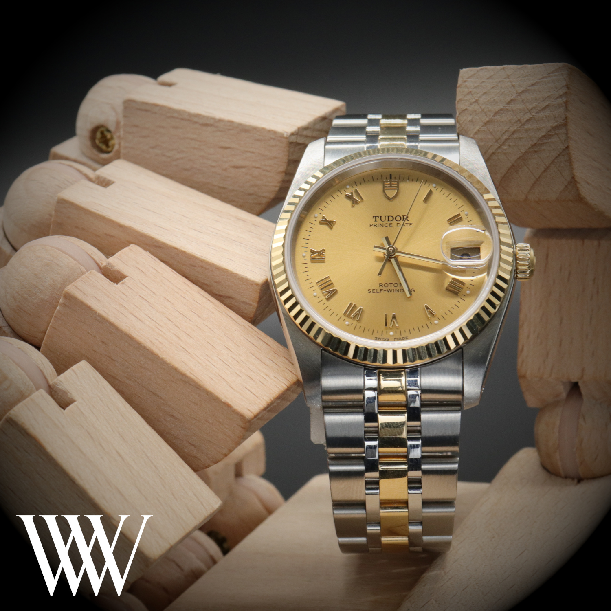

Luxury watches are revered for their status, craftsmanship, and timeless appeal. However there may come a time when you decide to part ways with your cherished timepiece. Whether you’re upgrading to a new model or simply in need of extra funds, selling or part-exchanging your automatic watch is a strategic move. To ensure you get the best price and a smooth selling experience, follow these steps and insights on how to navigate the process effectively.

## Gather Documentation

Having proper documentation is crucial when selling your automatic watch. Collect all the original paperwork that came with the watch, including the warranty card, instruction manual, tags, any service recrords, and the original purchase receipt. These documents not only further validate the authenticity of your watch, which can help with faster payouts and less hassle from potential buyers but also provide them with confidence in their purchase. Many dealers and individuals alike will disregard watches from the outset if there is no accompanying documentation - So it’s worth taking the time to find these items before listing. Watches with Box & papers add to the overall perceived value of the timepiece. Dealers understand this and so can offer a higher sum.

## Determine Your Watch's Condition

An accurate assessment of your watch’s condition is paramount. If the watch doesn’t match the description, dealers may penalise you on the price & submit a revised valuation, which is an inconvenience & can be disheartening to what otherwise should be a pleasant experience - Be honest with yourself about any visible wear and tear, scratches, or dings. Take high-quality photographs that clearly showcase the watch from different angles, highlighting it’s imperfections. Transparency about your watch’s condition can build trust with potential buyers and help you when setting a fair asking price.

## Understanding The Value of Your Watch & Setting a Realistic Asking Price

It’s a given that the perfect listing, with all the bells & Whistles of guarantees, excellent timekeeping, full service & refurbishment, a watch will sell for a premium & attract the most interest from serious buyers. However, sellers must be mindful that to provide these guarantees & warranties requires investment which will impact the selling price when listed by a dealer. It is therefor also important to be realistic when setting your asking price. Setting unrealistic asking prices will deter dealers from making an offer and in many cases is detrimental, as there will be much less dealers bidding for your watch.

## Be Patient

It may be tempting to lose hope if your listing isn’t attracting attention. Selling a high-quality luxury watch often requires patience. It may take some time to find the right buyer, especially if your piece is limited edition or rare. Be prepared to wait for the right buyer who recognizes the value of your watch. Perhaps consider submitting more or different photographs of your watch to entice those that may be on the fence about buying, or add some more information to the listing. It may be prudent to make the asking price more attractive, and accept a faster sale in return for a little less cash.

## Be Available & Respond to Potential Buyers Right Away

Communication is key here - Be as concise and accurate as possible when responding to questions & don’t leave interested parties waiting too long - Things can happen very quickly in the world of luxury watches - Budgets change, other watches may become available to them, or another seller may have their attention because they’re responding faster and seem more engaged. Dealers don’t want to feel they’re pressuring you & so it’s important to engage with them & get a deal completed that’s satisfactory for both parties.

## Finish Up & Completing Your Watch Sale

Selling your automatic watch can be a rewarding experience when done right & when selling to authentic, trustworthy individuals and dealers. By following these tips and taking a methodical approach, you can maximize the value of your timepiece and ensure a successful sale. Keep accurate records of the transaction & be sure to leave a review when selling to dealers - This helps others greatly when deciding who they wish to sell to. Take in to account time to payment & the general ease of ttransaction. Remember that patience, transparency, and thorough research are key elements in achieving the best price for your watch. Whether you’re parting ways with an heirloom or making room for a new addition to your collection, selling your watch should be a respectful process & WatchWise is a small community of people who are here to help every step of the way. Get in touch today to see how we can help you to extract the best value from your pre-owned luxury watch.
